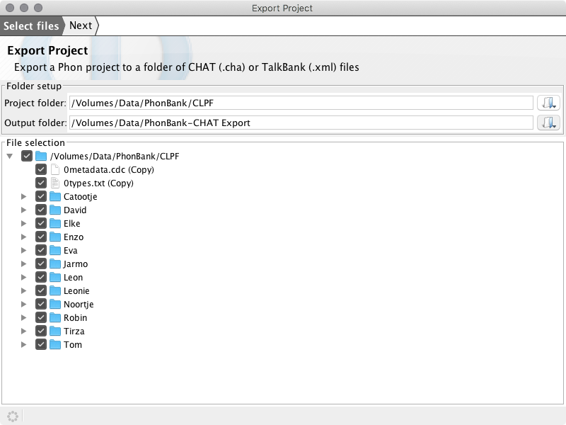
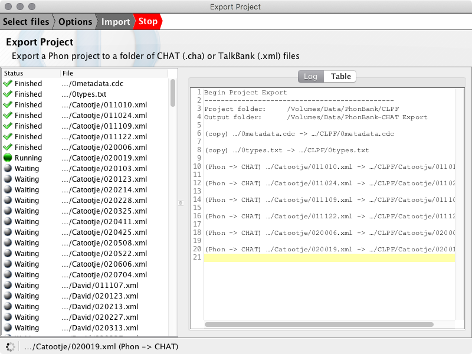

# Export Project

Export a Phon project to a folder of CHAT (.cha) or TalkBank (.xml) files.

The **Export Project** wizard is available from the **File** menu in Phon.

## Example

For this example we will export the CLPF Phoject create using the steps found at [Import Project](./import_project.md).

Open Phon, choose File -> Export Project from the window menu:

Select the project folder for export in the first field - you may type the filename or use the browse button. If the project is open, this will already be selected.
The folder name will be '/Volumes/PhonBank/CLPF' in our example. After selecting the project folder a list of available files for export will
be displayed in the file selection tree.

Enter the folder where the project will be exported in the output folder field. In the example below we use the folder '/Volumes/Data/PhonBank-CHAT Exports'.

Select files for export using the checkboxes in the file selection tree. Be default all files will be selected and all Phon session files will be detected
and selected for conversion. All other files will be copied into the export folder.

Click the 'Next' button at the top of the wizard to view the Options step. In this step you may choose to export Phon sessions as CHAT (.cha) or TalkBank (.xml) format.

Click the 'Next' button again to move to the export step. All selected files will appear in the table on the left and a log will appear on the right side of the window. The export process may take
some time. The export may be canceled at any time using the 'Stop' button at the top of the window.

When the export has been completed options to 'Open folder', 'Run again' and 'Close window' are displayed.

