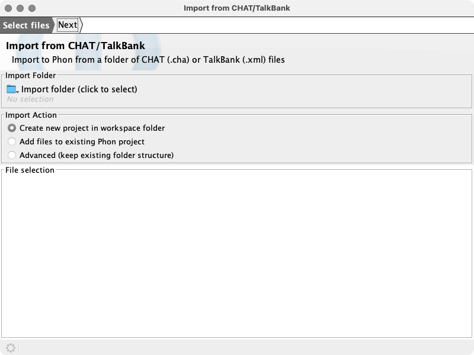
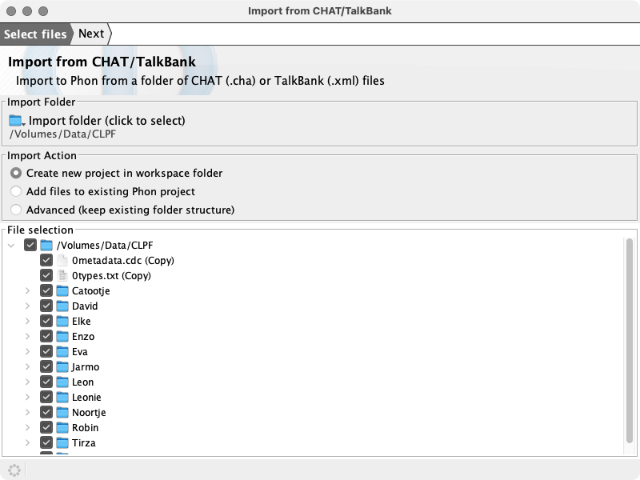
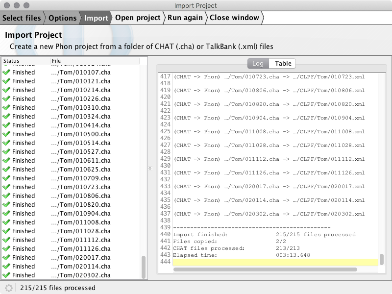

# Import Project

Create a new Phon project from a folder of CHAT (.cha) or TalkBank (.xml) files.

Corpora in CHAT format may be downloaded from:

 * [Index to PhonBank browseable database](https://phonbank.talkbank.org/access/)

 * [Index to CHILDES browseable database](https://childes.talkbank.org/access/)
  
The **Import Project** wizard is available from the **File** menu in Phon.

## Example

For this example we will import the CLPF corpus availabale at  as a new Phon project.
Begin by clicking the [CHAT data](https://phonbank.talkbank.org/data/Dutch/CLPF.zip) link and then extract the .zip file after downloading. 
For our example we will extract the downloaded CLPF.zip file into a folder nameed '/Volumes/PhonBank-CHAT'.

Open Phon, choose File -> Import Project from the window menu:

Enter the folder for import in the first field - you may type the filename or use the browse button. The folder name will be '/Volumes/PhonBank-CHAT/CLPF' in our example.
After selecting the import folder the Project name field will automatically be filled using the name of the selected import folder. A list of available files for import will
be displayed in the file selection tree.

Enter the folder where the new project will be created in the export folder field. By default this will be set to your workspace folder. In the example below we use the folder '/Volumes/Data/PhonBank'.

Select files for import using the checkboxes in the file selection tree. Be default all files will be selected and any CHAT (.cha) or TalkBank (.xml) files will be detected
and selected for conversion. All other files will be copied into the project folder.

Click the 'Next' button at the top of the wizard to view the Options step. In this step you may choose to syllabifiy and align any phonetic transcriptions found in the CHAT files for import.

Click the 'Next' button again to move to the import step. All selected files will appear in the table on the left and a log will appear on the right side of the window. The import process may take
some time. The import may be canceled at any time using the 'Stop' button at the top of the window.

When the import has been completed options to 'Open project', 'Run again' and 'Close window' are displayed.

To export this project back to CHAT or TalkBank format follow the instructions at  [Export Project (PhonTalk)](./export_project.md)