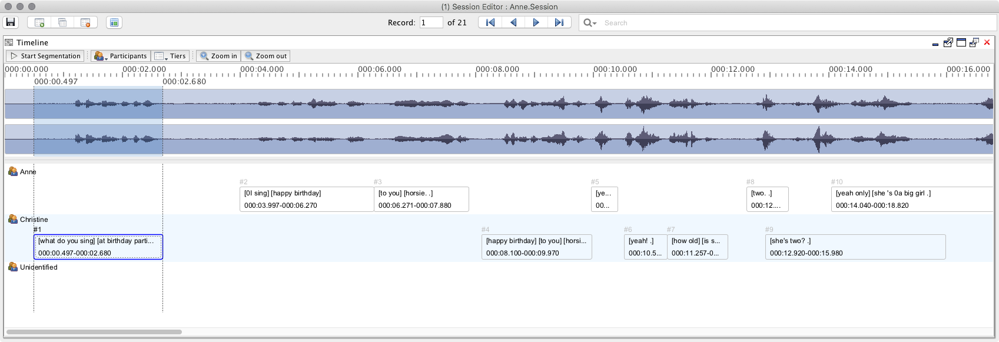

# View: Timeline (beta)

The Timeline view displays record data, and optionally the waveform for the session audio, along a horizontal timeline. The primary purpose of the Timeline view is to aid with segmentation and alterations of existing record segments.



The Timeline view has three main components:

 1. The timeline 

    The timeline is displayed at the top of the Timeline view and extends across the entire width. Ticks are drawn every 10px with a major tick at every 100px.  Time values are printed at every 2nd major tick.  
    
 1. The waveform

    The waveform is displayed if session audio is available.  

 1. The record grid

    Records are displayed with selected tier data along the timeline by speaker in rows. The current record will have a blue border and record number will be printed in black. Record segments may be adjusted via mouse interaction by either dragging the record segment along the timeline; or by adjusting the start/end values using displayed markers (dotted lines).

## Actions

### Media

The Timeline view interacts with the session media player if media is available.

#### Browse for media

If no media file has been assigned to the current session you may browse for a media file by selected ```Browse for Media``` in the context menu.

#### Generate session audio

If media is available for a session but no audio file (.wav) was found it may be generated by selecting ```Generate session audio``` in the context menu.

### Play segment

To play the segment of the current record - in the ```Media Player``` editor view - press the ```space``` key (only when record grid is focused and not in segmentation mode.)

### Adjust segment times

Segment start and end times may be adjusting using the markers (dotted lines) shown at the beginning and end of records. The start and end markers are always visible for the current record and are displayed when hovering over the end points of other record segments. Records may also be dragged horizontally along the timeline to adjust both start and end times.

### Delete record

To delete the current record select ```Delete record``` from the context menu or press ```Delete``` on the keyboard (only when record grid is focused.)

### Participants

Record data is printed by participant in rows.  By default all participants plus a row for ``Unidentified`` records are visible.

#### Hide/Show Participant

Participant visiblity can be toggled using the ```Participants``` submenu of the context menu or using the drop down menu displayed when clicking the ```Participants``` button in the toolbar.

#### Add Participant

To add a new participant to the session click ```Add Participant``` in the ```Participants``` submenu of the context menu or the dropdown menu displayed by clicking the ```Participants``` button in the toolbar.

#### Change Participant

Participant assignment for a record may be altered using the mouse by dragging the record segment up and down in the record grid. You may also use ```CMD```/```CTRL``` + ```1```...```9``` to select participant using the keyboard. Participant number is determined by position in the list of currently visible participants.  ```CMD```/```CTRL``` + ```0``` will remove participant assignment.

### Hide/Show Tier

By default the ``Orthography``  and ``Segment`` tiers are shown in the record grid. Tier visibility may be toggled using the ```Tiers``` submenu of the context menu or the drop down menu disiplayed by clicking the ```Tiers``` button in the toolbar.

### Zoom Out/In

The zoom out/in actions will decrease/increase horizontal resolution of the timeline.  These actions are available in the context menu and as toolbar buttons.

## Special Modes 

### Segmentation

Segmentation is the process of identifying records using the keyboard, usually while media is playing.  To enter Segmentation Mode click the ```Start Segmentation``` button in the ```Timeline``` editor view.  Before segmentation begins a dialog is displayed with options for media playback and segmentation behaviour.


If session media is loaded the following media playback options are available:

 1. Play media from beginning.
 1. Play media from current position (in media player view.) This is the default option.
 1. Play media from end of last record (by media time.)
 1. Play media from end of last record for participant (with participant selection.)

Playback start position will determine where segmentation begins in the timeline. If no media is available segmentation will always begin at 000:00.000.

There are two behaviours available when a new record is identified in segmentation mode:

 1. Insert new record at end of session

    Use this option when segmenting a new media file or continuing segmentation. 

 1. Replace segment for current record
 
    Use this option when re-segmenting an already segmented session.  Once all records segments have been overwritten new records will be inserted at end of the session.
    
During segmentation mode all keyboard input for the application will be blocked except the following keystrokes:

#### Segmentation Controls

| Action | Keystroke(s) |
|---|---|
| Stop segmentation | ```Esc``` | 
| Break (e.g., silence, noise, etc.) | ```b``` or ```Numpad decimal``` |
| New segment (unidentified) | ```Space``` or ```0``` or ```Numpad 0``` |
| New segment (participant 1...9) | ```1```...```9``` or ```Numpad 1```...```Numpad 9``` |
| Toggle segmentation window | ```W``` |
| Increase segmentation window (100ms) | ```Up``` |
| Decrease segmentation window (1000ms) | ```Down``` |

#### Media Controls

| Action | Keystroke(s) |
|---|---|
| Volume up | ```Shift+Up``` or ```Numpad multiply``` |
| Volume down | ```Shift+Down``` or ```Numpad divide``` |
| Go back 1s | ```Left``` or ```Numpad subtract``` |
| Go forward 1s | ```Right``` or ```Numpad add``` |
| Go back 5s | ```Shift+Left``` or ```Shift+Numpad subtract``` |
| Go forward 5s | ```Shift+Right``` or ```Shift+Numpad add``` |

While segmentation mode is active, a yellow segment will be painted in the Timeline view.  When a new record is identified using the ```Space``` or ```1```...```9``` or ```Numpad 1```...```Numpad 9``` keys the segment identified by yellow will become the media segment for the new record.

// INSERT SCREENSHOT OF SEGMENTATION WINDOW

### Split Record

Records segments may be split using the record grid. To enter ``Split mode`` press the ```S``` key or select ```Split record``` from the context menu. A new marker will appear in the middle of the current record segment.  This new marker can be dragged to adjust the position of the record split. Press ```Enter``` to accept the record split as shown and create the new record. ``Split mode`` can be exited using the ```Escape``` key and will also exit if the current editor record is switched or the current record segment is modified.

// INSERT SCREENSHOT OF SPLIT MODE

Record data may be split by group number by using the ```0```...```9``` keys on the keyboard. ```0``` will move all record data into the new record while ```1```...```9``` will split data after group 1, 2, etc,. Split position can be set using the context menu as well.

// INSERT RECORD OF SPLIT MODE W/ GROUP SPLIT