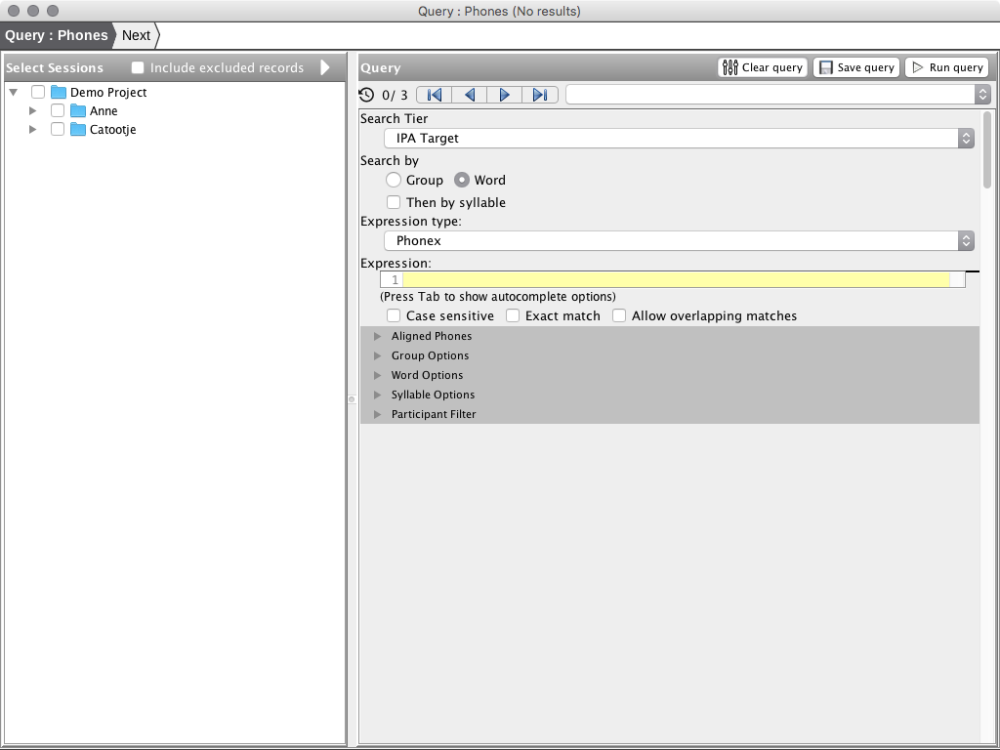
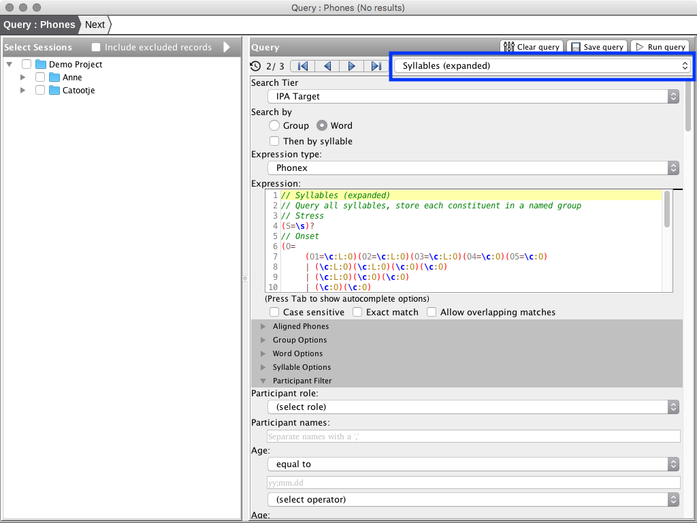

# Step 1: Query

The first step of the query wizard is to select sessions enter query parameters. Once query paremeters have been entered, click the 'Run Query' button (shortcut ```F7```) to execute the query.



## Named Queries

Named queries are available via a combo-box menu in the top-right portion of the query parameters section. Some queries have pre-defined queries provided with the application. Query parameters can be saved as a new named query using the 'Save Query' button.



## Query History

The parameters of each executed query are saved in the query history.  When opening the Query and Report wizard the most recent entry in the query history is loaded. Query history can be navigated using buttons in the top-left portion of the Query Parameters section. Actions for removing entries and clearing the query history are available in the Query window menu.


## Query Results

Queries are executed by clicking the 'Run Query' button. Query results are displayed in a table on the left-hand side of the screen (replacing the session selector.) Queries can be executed more than once, the results of each execution will be titled 'Query 1', 'Query 2', 'etc.' You can select the active result set using the combo-box in the top-right corner of the Query Results view. Result sets can be viewed by double-clicking a row in the table.


> Only the active result set will be used in the report steps of the wizard. The active result set is indicated in the title of the window.

The session selector can be displayed again using the button on the top-left portion of the Query Results view. Results from executed queries are shown in the session selector tree to allow comparisons between executed queries for individual sessions. Result sets may be viewed by double-clicking the result set in the tree.


